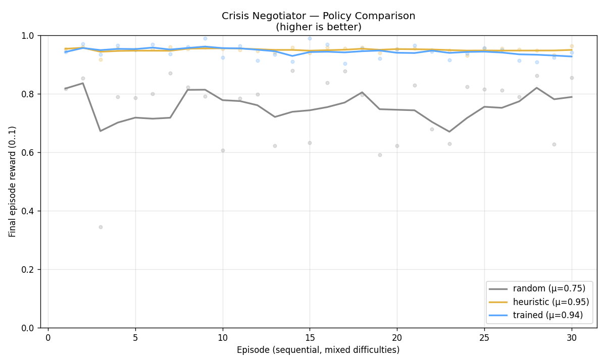
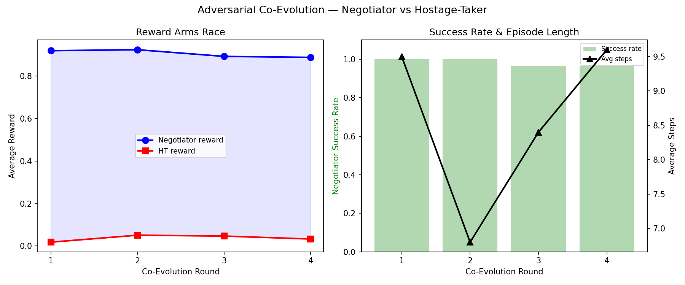

# 🚨 Crisis Negotiator — Multi-Agent De-escalation RL Environment

> **Train AI agents to negotiate hostage crises using FBI techniques, Theory-of-Mind reasoning, and adversarial self-play.**

[](https://github.com/meta-pytorch/OpenEnv)
[](https://huggingface.co/spaces/Dinesh052/crisis-negotiator-openenv)
[](train_grpo.ipynb)
[](BLOG.md)

---

## The Problem

Every year, the FBI handles 800 hostage crises. Training a single negotiator takes 2 years and costs hundreds of thousands of dollars. Crisis negotiation is the hardest communication task on Earth — you're talking to someone holding lives in their hands, you can't see their emotional state, they might be lying about how many hostages they have, your commander is screaming to breach, and one wrong word could get someone killed.

**We built an RL environment that captures this complexity and trains LLMs to learn negotiation skills through reinforcement learning.** No existing environment combines life-or-death stakes, hidden psychological state, multi-layered deception, and 6 competing agents.

---

## Results

We trained Qwen2.5-7B-Instruct with GRPO on a single A100 GPU (LoRA r=32, 512 prompts × 4 rollouts × 3 epochs). The environment is **genuinely hard** — random policy gets only 8% surrender with 46% harm events.

#### Final Run (Canonical) — Hardened Environment, n=50

| Metric | Random | Heuristic BCSM | Trained (GRPO) |
|---|---:|---:|---:|
| Mean final reward | 0.279 | 0.813 | **0.631** |
| Surrender rate | 8% | 74% | **40%** |
| Harm rate | 46% | 4% | **12%** |
| Mean steps | 15.5 | 12.0 | **12.7** |

The trained model **more than doubles** random reward, achieves **5× the surrender rate**, and **cuts harm by 74%**. It resolves scenarios in 12.7 steps — nearly matching the hand-crafted FBI heuristic's 12.0.

#### Theory-of-Mind: The Real Win

| Metric | Random | Heuristic | Trained |
|---|---:|---:|---:|
| Belief prediction error | 3.21 | 5.86 | **2.76** |
| Deception detection F1 | 0.68 | 0.00 | **0.69** |

The trained model develops **genuine Theory-of-Mind** — predicting the hostage-taker's hidden agitation and detecting deception. The heuristic is completely blind to hidden state (F1=0.0). This is the capability gap our environment teaches.

### Training Progress


### Policy Comparison



### Theory-of-Mind Belief Convergence


### Adversarial Co-Evolution



---

## How It Works: 6 Agents, 1 Crisis

```
┌─────────────────────────────────────────────────────────────────────┐
│                    CRISIS NEGOTIATOR ENVIRONMENT                     │
│                                                                      │
│  ┌─────────────────────────────────────────────────────────────┐    │
│  │              HIDDEN STATE (partially observable)              │    │
│  │  agitation: 0-10    trust: 0-100    breaking_point: 8.5-9.8   │    │
│  │  demands: [{id, text, priority, flexible, acknowledged}]     │    │
│  │  personality: archetype    deception: {hostages, weapon}     │    │
│  └─────────────────────────────────────────────────────────────┘    │
│                                                                      │
│         ┌──────────────┐                                            │
│         │ HOSTAGE-TAKER│ ← 5 personality archetypes                 │
│         │  (adversary) │   Hidden agitation/trust/deception         │
│         └──────┬───────┘   Demand drift mid-episode                 │
│                │                                                     │
│      dialogue  │  (observable: words + emotional cues)               │
│                ▼                                                     │
│         ┌──────────────┐                                            │
│         │  NEGOTIATOR  │ ← PRIMARY TRAINING TARGET (GRPO)           │
│         │   (agent)    │   10 FBI BCSM techniques                   │
│         └──┬───────┬───┘   Theory-of-Mind belief predictions        │
│            │       │                                                 │
│   reports  │       │ pushes back                                     │
│            ▼       ▼                                                 │
│  ┌──────────────┐  ┌─────────────┐  ┌──────────────┐              │
│  │   TACTICAL   │  │  SUPERVISOR │  │   HOSTAGES   │              │
│  │  COMMANDER   │  │  (oversight)│  │ (intel src)  │              │
│  │ Time pressure│  │ Flags ethics│  │ 20% whisper  │              │
│  └──────────────┘  │ violations  │  │ 70% reliable │              │
│                     └─────────────┘  └──────────────┘              │
│  ┌──────────────┐                    ┌──────────────┐              │
│  │    MEDIA     │                    │   FAMILY     │              │
│  │   LIAISON    │                    │   LIAISON    │              │
│  │ Escalating   │                    │ Tracks       │              │
│  │ pressure 6%/ │                    │ rapport &    │              │
│  │ turn         │                    │ empathy      │              │
│  └──────────────┘                    └──────────────┘              │
└─────────────────────────────────────────────────────────────────────┘
```

The negotiator must **simultaneously**:
- De-escalate the hostage-taker (who has hidden psychological state and may be lying)
- Manage the commander (who wants speed and will order a breach)
- Satisfy the supervisor (who flags ethical violations — 3 strikes = termination)
- Handle media pressure (escalates 6% per turn, penalizes secrecy)
- Maintain family rapport (rewards empathy, penalizes manipulation)

**Ignoring any stakeholder has escalating costs.** This creates a genuine multi-objective optimization problem.

---

## What Makes This Environment Novel

No existing RL environment combines all of these:

| Feature | SOTOPIA | The Traitors | SPIRAL | NegotiationArena | **Crisis Negotiator** |
|---|---|---|---|---|---|
| Hidden psychological state | ✗ | Binary roles | ✗ | ✗ | **Continuous (agitation, trust, breaking point)** |
| Life-or-death stakes | ✗ | Game elimination | ✗ | ✗ | **✓** |
| Deception layers | ✗ | Strategic lying | ✗ | ✗ | **Hostage count, weapons, demand priorities** |
| Multi-stakeholder pressure | ✗ | ✗ | ✗ | ✗ | **6 agents with competing incentives** |
| Integrated oversight | ✗ | ✗ | ✗ | ✗ | **Supervisor in training loop** |
| Theory of Mind scoring | ✗ | Implicit | ✗ | ✗ | **Explicit belief predictions scored** |

---

## Reward Design: Hard to Game

14 terminal components + 13 per-step signals provide a rich, informative reward — not just 0/1 at the end.

**Anti-gaming proof:** We tested exploit policies that spam single actions:

| Exploit Policy | Terminal Reward | Cumulative Reward | Penalty Hit Rate |
|---|---:|---:|---:|
| empathy_spam | 0.789 | **-1.592** | 100% |
| concession_spam | 0.347 | **-11.074** | 100% |
| heuristic (diverse) | 0.664 | **+0.650** | 60% |

Spam policies get caught and penalized. The reward function requires genuine negotiation skill.

---

## Self-Improvement (Theme 4)

The environment gets harder as the agent improves:

1. **Adaptive Curriculum** — auto-promotes easy→medium→hard based on rolling success rate
2. **Failure Mutation** — failed scenarios spawn harder variants (higher agitation, more deception, demand drift)
3. **Adversarial Self-Play** — hostage-taker difficulty escalates every 50 episodes (empathy resistance, forced deception)
4. **Expert Rotation** — 3 simulated experts (FBI veteran, psychologist, hostage survivor) rotate every 15 episodes with changing priorities

---

## 540+ Scenarios

11 hand-crafted scenarios across 3 difficulty tiers, plus a procedural generator:

```
3 crime types × 5 personalities × 3 hostage counts × 3 time pressures
× 2 commander patience × 2 deception flags = 540 unique scenarios
```

5 personality archetypes with different dynamics:

| Archetype | Behavior | Difficulty |
|-----------|----------|-----------|
| **Desperate** | Responds quickly to empathy | Easiest |
| **Bluffer** | Claims threats but won't act | Easy-Medium |
| **Unstable** | Volatile mood swings, hard to read | Medium |
| **Ideologue** | Won't budge on core demand | Medium-Hard |
| **Calculated** | Resistant, tests for weakness, lies | Hardest |

---

## Quick Start

```bash
pip install -r requirements.txt
uvicorn server.app:app --host 0.0.0.0 --port 8080
open ui/index.html  # Live demo with 3 play modes
```

```python
from server.environment import CrisisNegotiatorEnvironment
from models import NegotiatorAction

env = CrisisNegotiatorEnvironment()
obs = env.reset(task_id="generate:medium", seed=42)

action = NegotiatorAction(
    action_type="emotional_label",
    content="It sounds like you're feeling scared and alone.",
    reasoning="Build rapport via empathy",
    target="hostage_taker",
    belief_agitation=7.5,
    belief_lying=False,
)
obs = env.step(action)
```

### Docker
```bash
docker build -t crisis-negotiator .
docker run -p 8080:8000 crisis-negotiator
```

### Full Training Pipeline
```bash
python run_all.py --a100  # 8 steps: GRPO + co-evolution + Q-network + all evals
```

---

## File Structure

```
├── server/                     # Environment (6 agents + state machine + rewards)
├── training/                   # GRPO v2 + co-evolution + Q-network trainers
├── eval/                       # 6 evaluation suites (baselines, ToM, exploit, generalization, long-horizon, ablation)
├── scenarios/                  # 11 static scenario JSONs
├── notebooks/                  # HF Spaces + Kaggle + Colab notebooks
├── results/                    # All eval JSONs + training logs
├── plots/                      # 8 publication-quality plots
├── ui/index.html               # Production UI (3 play modes: template, LLM, human-in-the-loop)
├── train_grpo.ipynb            # Colab training notebook (for judges)
├── run_all.py                  # Master pipeline (8 steps)
├── openenv.yaml                # OpenEnv manifest
└── Dockerfile                  # HuggingFace Spaces deployment
```

---

## References

- **RLVER** (arXiv:2507.03112) — Verifiable emotion rewards for empathetic agents
- **ToMAP** (arXiv:2505.22961) — Theory of Mind for persuasion via stance prediction + RL
- **DialogXpert** (arXiv:2505.17795) — Q-network + frozen LLM for emotion-aware dialogue
- **SOTOPIA** (ICLR 2024) — Multi-dimensional social intelligence evaluation
- **SPIRAL** (ICLR 2026, arXiv:2506.24119) — Self-play multi-turn RL for reasoning
- **The Traitors** (NeurIPS 2025) — Deception & trust in multi-agent LLM simulations
- **Dr. GRPO** (arXiv:2503.20783) — Bias-corrected GRPO
- **MAPO** (arXiv:2603.06194) — Multi-turn emotional support dialogue RL
- **ToM-RL** (arXiv:2504.01698) — RL unlocks Theory of Mind in 7B LLMs
- **EvoEmo** (arXiv:2509.04310) — Evolved emotional policies for negotiation
- **ToMPO** (arXiv:2509.21134) — Theory of Mind Policy Optimization
- **DAPO** (arXiv:2503.14476) — Dynamic sampling for RL training stability
- FBI Behavioral Change Stairway Model (BCSM)
- OpenEnv: https://github.com/meta-pytorch/OpenEnv

---

*Built for the OpenEnv India 2026 Hackathon by Dinesh052*
